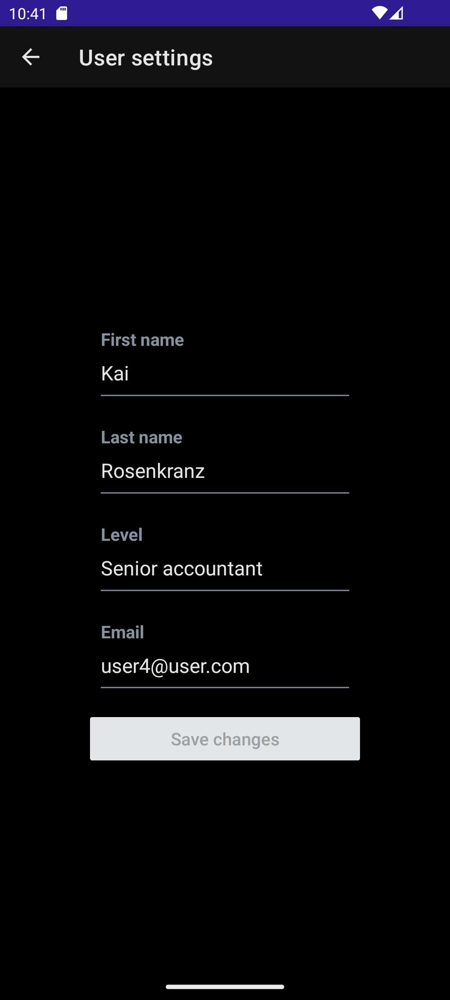

# To do - Native

This is a simple to do app in React Native (Expo). Set up the table with your colleagues, workmates or family and start planning your responsibilities together.

## Table of Contents

- [Installation](#installation)
- [Usage](#usage)
- [Configuration](#configuration)
- [Credits](#credits)

## Installation

### Backend

This project shares backend with [To do app](https://github.com/rafalbodanka/todo_app). Check out installation process [here](https://github.com/rafalbodanka/todo_app#backend).

### Frontend

1. Open a new terminal and navigate to the frontend folder.
2. Install the required dependencies by running the following command:

   ```bash
   npm install
   ```

3. Start the development server by running the following command:

   ```bash
   npm start
   ```

Once both the backend and frontend servers are running, you should be able to access the app in your web browser at http://localhost:3000.

## Usage

Stay up to date with your crew's duties.


Create and manage the tables.


Create and manage the tasks.


Update your personal data.




Manage the table invitations.


## Configuration

# Backend 

Checkout To do app configuration section [here](https://github.com/rafalbodanka/todo_app#configuration).

# Frontend

In frontend folder, create and open the .env file and add the environment variable in the following format:

EXPO_PUBLIC_API_URL: EXPO_PUBLIC_API_URL: For local development, find the local IP address of your PC or laptop where you host the backend. It should be in a format similar to this: http://192.168.1.1:5000. Ensure that your backend server is running on the same network as the Mobile Device Emulator. For more details, refer to the [Expo Docs](https://docs.expo.dev/guides/environment-variables/).

Setting up development environment. [Expo with Android Studio](https://docs.expo.dev/workflow/android-studio-emulator/)

## Credits

This project utilizes most of all the following libraries, frameworks, and resources:

- [React-Native](https://reactjs.org/): A JavaScript library for building user interfaces.
- [Expo](https://expo.dev/): React Native ecosystem for building apps.
- [NativeWind](https://www.nativewind.dev/): An universal style system for React Native.
- [Axios](https://axios-http.com/): A promise-based HTTP client for making API requests.
- [React-Native-Elements](https://reactnativeelements.com/): A popular UI component library for React Native.
- [React-Native-bouncy-checkbox](https://github.com/WrathChaos/react-native-bouncy-checkbox): A library for bouncy checkboxes in React Native.
- [React-Native-calendar-picker](https://www.npmjs.com/package/react-native-calendar-picker): A calendar picker component for React Native.
- [React-Native-gesture-handler](https://docs.swmansion.com/react-native-gesture-handler/docs/): A library for handling gestures in React Native.
- [React-Native-Reanimated](https://docs.swmansion.com/react-native-reanimated/): A library for handling animations in React Native.
- [React-Native-select-dropdown](https://www.npmjs.com/package/react-native-select-dropdown): A library for creating select dropdowns in React Native.
- [React-Native-vector-icons](https://www.npmjs.com/package/react-native-vector-icons): A library for using vector icons in React Native.

Please refer to the documentation or official websites of these resources for more information on how they were used in this project.
